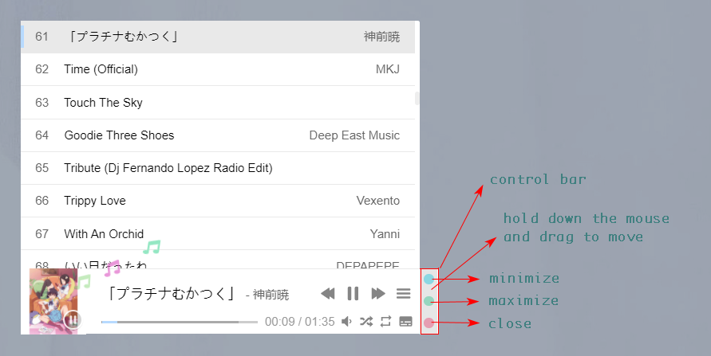

Modify the “miniswitcher” noninvasively and it can realize the dragging, moving, minimizing, maximizing and closing of aplayer like a window.

非侵入式修改Aplayer，它可以像窗口一样实现Aplayer的拖拽移动、最小化、最大化和关闭。


请在 `fixed` 模式下使用。

Please use it in `fixed` mode.

```js
<link type="text/css" rel="stylesheet" href="movadsorbent.min.css" />
<script type="text/javascript" src="movadsorbent.min.js"></script>

<script>
    var audioInfoList = []
	var aplayer = new APlayer({
    	container: document.getElementById('aplayer'),
    	volume: 0.5,
    	audio: audioInfoList,
    	lrcType: 3,
    	fixed: true,
    	autoplay: false,
    	order: 'random'
	});
	new Movadsorbent(aplayer);
<script/>
```



